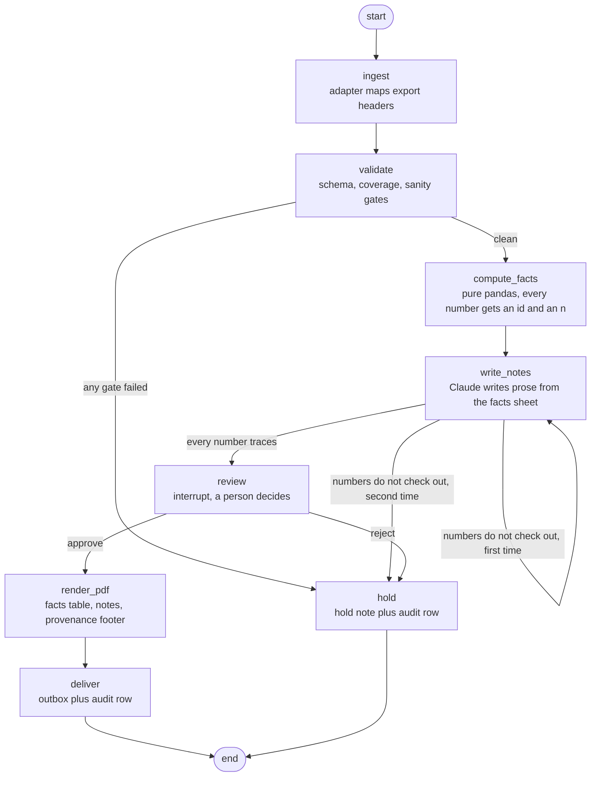
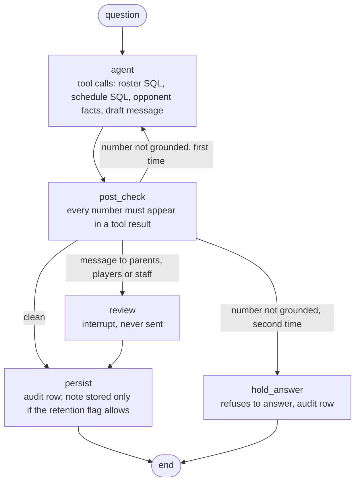

# yds_graph

A working model of how a scouting report gets built when a model is in the
loop, and Bench Coach, a small staff assistant built on the same rules.

Two LangGraph graphs, one doctrine. The report graph turns a pitch tracking
export into a one page per pitcher PDF, and refuses to produce one when the
data or the prose does not hold up. The Bench Coach graph answers staff
questions over a small SQL database and refuses to state a number it cannot
trace.

Everything in this repo is synthetic. No real coach, school, program, player
or vendor appears anywhere in it.

## The doctrine, in five bullets

1. Numbers come from deterministic code. `facts.py` computes every number a
   report can contain. The model never sees the raw file and never computes.
2. The model writes prose from a computed facts sheet, and nothing else. Each
   number in the prose carries a fact id.
3. Gates block and never guess. Schema, coverage and sanity are checked in
   code. A failure holds the whole report; it does not degrade it.
4. A person approves before delivery. The graph pauses at a real interrupt.
   Nothing reaches the outbox without a human decision on the record.
5. Every run writes an audit row with a version stamp and data provenance,
   including the runs that stop early. Errors are loud to the operator and
   kind to the coach.

The sixth rule, which is really the first: the check on the model is code, not
instructions. The prompt asks for cited numbers. `checks.py` then proves it,
number by number, and a single number that does not trace back holds the run.

## The report graph



## The Bench Coach graph



## Running it

```bash
python3 -m venv .venv
.venv/bin/python -m pip install -r requirements.txt
.venv/bin/python scripts/make_sample_data.py      # seeded synthetic data
cp .env.example .env                              # then put a key in it
```

Everything below runs against the real model. Prefix any command with
`YDS_GRAPH_STUB=1` to run the entire pipeline with a deterministic stub and no
network, which is how the tests run.

```bash
# a clean file: pauses for review
.venv/bin/python -m yds_graph run inbox/sample.csv --coach sample

# resume from that thread id, from this shell or any other
.venv/bin/python -m yds_graph resume <thread_id> --approve
.venv/bin/python -m yds_graph resume <thread_id> --reject "velocity looks off in game two"

# a file that should never produce a report
.venv/bin/python -m yds_graph run sample_data/bad_schema.csv --coach sample
.venv/bin/python -m yds_graph run sample_data/thin_coverage.csv --coach sample

# Bench Coach
.venv/bin/python -m yds_graph ask "What do we have on the Friday matchup?"
.venv/bin/python -m yds_graph ask "Follow up on that" --session <session_id>

# what happened, and to which file
.venv/bin/python -m yds_graph audit
```

`make test`, `make run-sample` and `make ask` wrap the common ones.

## Run it for free on a local model

Nothing in the doctrine depends on which model writes the prose, so the whole
pipeline runs against a model you host yourself, with no key and no bill. Any
server that speaks the OpenAI chat API works. llama.cpp's server does, and so
does ollama.

Start a server:

```bash
# llama.cpp
llama-server -m /path/to/model.gguf --port 8080 --jinja

# or ollama, which already listens on 11434
ollama serve
```

Point the pipeline at it:

```bash
export YDS_MODEL_BASE_URL=http://localhost:8080/v1   # ollama: http://localhost:11434/v1
export YDS_MODEL_NAME=your-model-name                # llama.cpp is happy with any name
# export YDS_MODEL_API_KEY=none                      # llama.cpp ignores it
# export YDS_MODEL_BACKEND=openai_compat             # only needed to force the choice
```

With no `ANTHROPIC_API_KEY` set, `YDS_MODEL_BASE_URL` is enough. A key still
holding the placeholder from `.env.example` counts as no key. The three
variables also work in `.env`.

Then everything runs the same way:

```bash
.venv/bin/python -m pytest                    # offline suite, no model at all
.venv/bin/python -m pytest -m live -rs        # the two live tests, on your local model
.venv/bin/python -m yds_graph run inbox/sample.csv --coach sample
.venv/bin/python -m yds_graph resume <thread_id> --approve
.venv/bin/python -m yds_graph ask "Our shortstop is out this weekend, who can play there?"
```

Two things the hosted API gives you for free are written out by hand for a
local model, in `model.py` and `assistant_graph.py`:

- **Structured output.** The notes step asks for one JSON object per pitcher,
  with `response_format={"type": "json_object"}` when the server supports it
  and a second attempt without it when the server does not. The reply is read
  by locating the first balanced JSON object, so a code fence or an apology in
  front of it does not fail a run. An unreadable reply is retried exactly once.
- **Tool calling.** Bench Coach runs a ReAct loop instead of native tool use:
  the model answers with `{"tool": "query_roster", "args": {...}}` or
  `{"final": "..."}`, code executes the tool and feeds the result back, and the
  loop is capped at six steps.

What does not change is the part that matters. The facts sheet, `checks.py`,
the gates, the human interrupt and the audit row are the same code on every
backend. A small local model that invents a number gets held exactly like any
other model, and there is a test that proves it.

Expect a small local model to be slower and to fail the post-check more often
than a frontier model. That is a real result, not a bug: a held run is the
pipeline working. Two things learned from running a 3B model against it, both
fixed in the prompt rather than in the check: a small model obeys "write
exactly 5 sentences" far better than "write 4 to 7", and it has to be told to
write the pitcher id exactly as given, because a spelled out "Opponent 24"
puts a loose 24 in a sentence and the check is right to reject it.

### Resuming

The graphs use a SQLite checkpointer at `state/checkpoints.sqlite`, so a run
that paused in one process resumes in another by thread id. `run` prints the
thread id and the exact resume commands. There is a test that proves this
across two real subprocesses.

## Three worked examples

**Friday matchup.**

```
$ python -m yds_graph ask "What do we have on the Friday matchup?"
Here is what is on file for the next series. Schedule rows on file:
[{"date": "2026-09-11", "opponent": "Opponent A", "site": "home", "travel": "none"}, ...]
For OPP-11, the facts sheet reads: [f1] Fastball usage overall: 54.2% (n=308)
[f2] Slider usage overall: 25.0% (n=308). Those are the only numbers on file
for that pitcher.

session=ask-c82a84c771 status=done retention=store stored=True
```

Every number in that answer came back from `query_schedule` or
`opponent_facts`, and the post-check proved it before the answer was printed.

**Shortstop out.**

```
$ python -m yds_graph ask "Our shortstop is out this weekend, who can play there?"
On file, these players have taken reps at SS: Cedar, Dogwood, Fir, Larch, Oak,
Spruce. That is what the roster records, not a depth chart. The staff decides
the order. Availability detail stays with the staff and is not written down
here.

session=ask-60e56345de status=done retention=do_not_store stored=False
```

The answer is a roster query, not a recommendation. The question tripped the
retention flag, so the note was not written to the database. The audit row
records that it was answered and that nothing was stored.

**Parent message.**

```
$ python -m yds_graph ask "Draft a message to parents about the weekend series."
I put together a draft for parents. Nothing has been sent and nothing will be
sent by me. It is waiting for a coach to read it.

========================================================================
PAUSED FOR HUMAN REVIEW
========================================================================
{ "kind": "message_review", "drafts": ["kind=parents\nstatus=NEEDS HUMAN REVIEW..."] }

  approve: python -m yds_graph resume ask-9887767da5 --approve
```

The graph stops. There is no send path in this program at all, and approving
records that a person read it rather than delivering anything.

## What the tests prove

`make test` runs the suite with no network at all.

- A bad schema export stops at `validate`. Nothing reaches the outbox, a hold
  note exists with both a coach paragraph and an operator paragraph, and the
  audit row says HOLD with the gate code in the reason.
- A thin coverage export stops at `validate` for too few games and too few
  pitches.
- A fake model that invents a number is caught by the post-check, retried
  exactly once, and then held. The delivery path never runs.
- Rejecting at review delivers nothing and writes the reason into the hold
  note. Approving produces a PDF whose bytes contain the version stamp, the
  source file and its hash.
- A run paused in one process resumes in another, through the checkpointer.
- Bench Coach: a parent message request ends at an interrupt rather than a send.
  A numeric answer traces every number to a tool result. An injury question is
  not written to the database. An invented number holds the answer.
- The SQL tools refuse anything that is not a single SELECT on their own table.
- A pitcher id is an identifier, not a statistic: naming OPP-11 in a sentence
  does not fail a draft, while a bare 11 still does.
- Against a local server: a JSON payload buried in prose and a code fence is
  still read, an unreadable answer is retried exactly once, a server that
  rejects `response_format` is asked again without it, and the tool loop reads
  the action shapes small models actually emit. A local model that invents a
  number is held like any other.

The local model path is covered offline too. A tiny HTTP server runs in a
thread and speaks the OpenAI chat schema, so the tolerant JSON parser, the one
retry, the fallback for a server that rejects `response_format`, and the whole
ReAct tool loop are proved without a network.

Two tests are marked `live` and run a real model end to end, including the
same post-check on real output. They run against whichever backend is
configured, and skip with a message naming what is missing when neither is:

```bash
.venv/bin/python -m pytest -m live -rs
```

## Honest claim

LangGraph on a side project; production agents at work are custom Python and
MCP. This repo exists to make the rules visible and testable in a form
somebody else can run, not to claim a framework.

## Layout

```
yds_graph/
  adapters.py          export headers to one canonical schema
  gates.py             schema, coverage and sanity gates
  facts.py             every number, with an id, an n and a provenance block
  checks.py            the post-check that proves the prose
  model.py             the only file that talks to Claude, plus the stubs
  render.py            the PDF, with the provenance footer
  audit.py             the audit table
  report_graph.py      part one
  assistant_graph.py   part two, the Bench Coach graph
  tools.py             Bench Coach's SQL tools and database
scripts/make_sample_data.py
sample_data/           synthetic exports, roster, schedule, philosophy
tests/
```

## Model

`claude-opus-5` by default: adaptive thinking, structured output for the notes
step, a manual tool loop for Bench Coach. `model.py` is the only file that
talks to a model, and it has a second live path for any OpenAI compatible
server, so the same pipeline runs on a model on your own machine. See "Run it
for free on a local model". Pinned dependency versions are in
`requirements.txt`.
